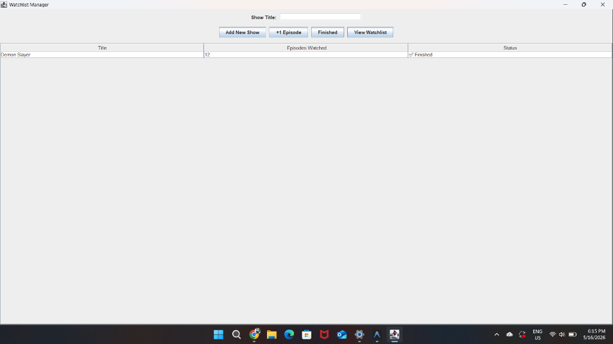
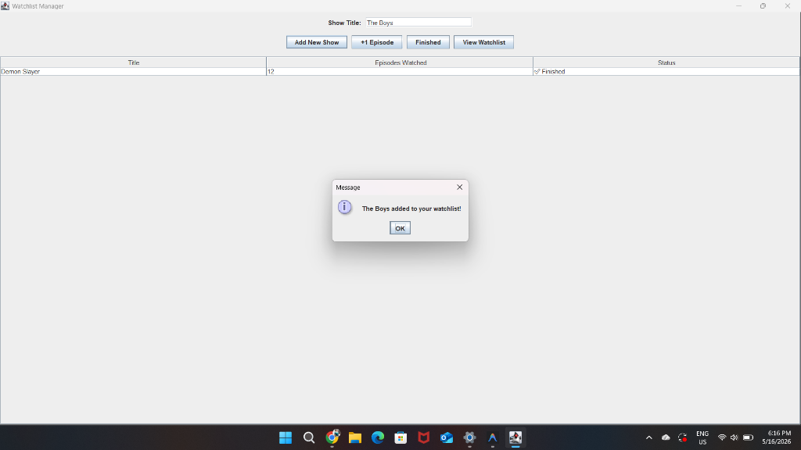
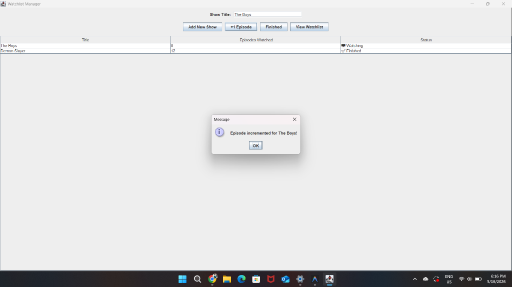

# 📺 Watchlist Manager

A lightweight desktop application built with **Java Swing** and **MySQL (JDBC)** to track your TV shows and episodes.

## Features

- **Add Shows** — Add new TV series to your personal watchlist
- **Track Episodes** — Increment episode count with a single click as you watch
- **Mark as Finished** — Flag shows you've completed watching
- **Live Watchlist View** — See all your shows, episode counts, and status in a clean table
- **Persistent Storage** — All data is stored in a MySQL database, so nothing is lost between sessions

## Tech Stack

- **Java** — Core language
- **Swing** — GUI framework
- **JDBC** — Database connectivity
- **MySQL** — Relational database for persistent storage

## Prerequisites

- Java JDK 8+
- MySQL Server 8.0+
- MySQL Connector/J (`mysql-connector-j-9.7.0.jar`)

## Setup

1. Create the database:
```sql
CREATE DATABASE watchlist_db;
USE watchlist_db;

CREATE TABLE shows (
    id INT AUTO_INCREMENT PRIMARY KEY,
    title VARCHAR(100) NOT NULL UNIQUE,
    episode INT DEFAULT 0,
    finished BOOLEAN DEFAULT FALSE
);
```

2. Update your MySQL credentials in `WatchlistManager.java`
3. Compile and run:
```bash
javac -cp ".;mysql-connector-j-9.7.0.jar" WatchlistManager.java
java -cp ".;mysql-connector-j-9.7.0.jar" WatchlistManager
```

## Screenshots

### Main Interface


### Add New Show


### Mark as Finished


### Increment Episode

